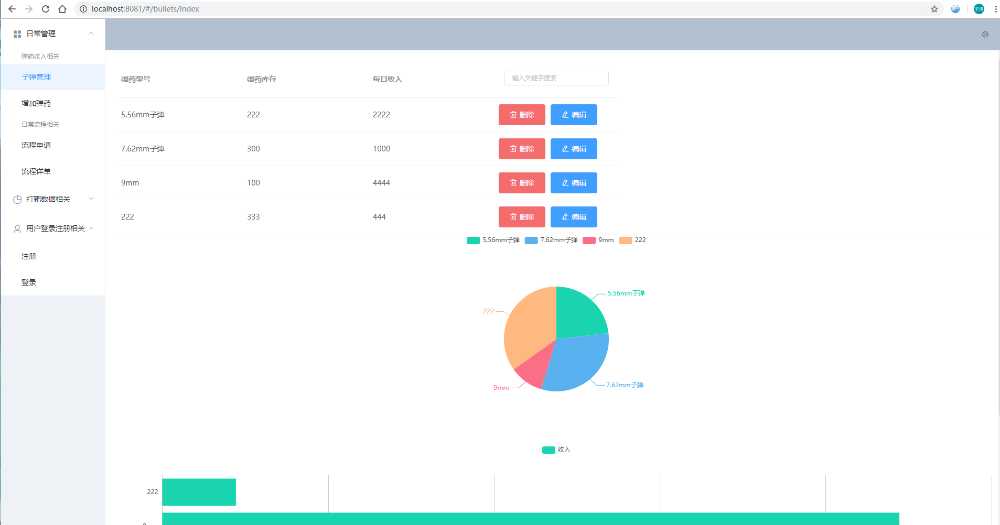
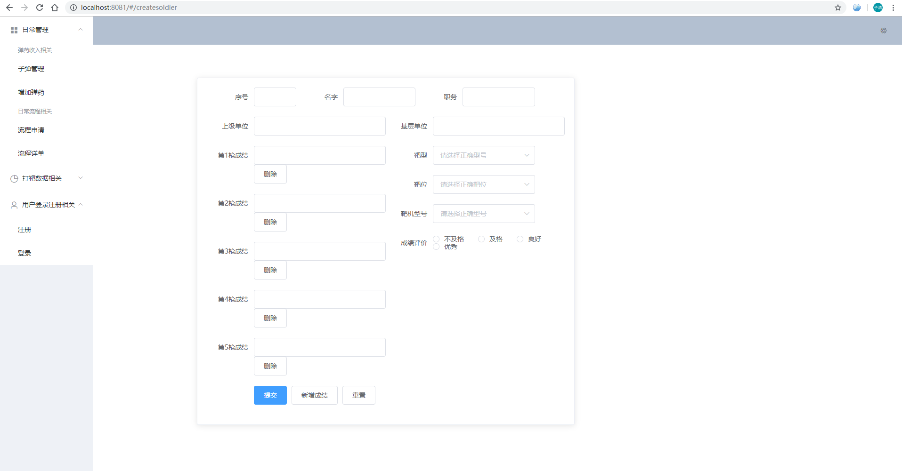
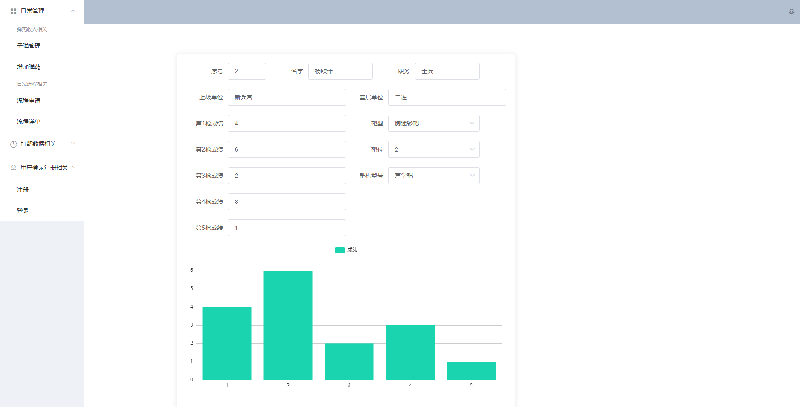

# ShootingDatabaseSystem
Vue.js + node.js + express + MongoDB 
element-UI + v-charts + axios 
## Project image


### Project image




### Project image




### Project run

1.启动mongodb 
```
cmd中 mongod --dbpath "C:\Program Files\MongoDB\Server\4.0\data\db"
再运行  mongo
```
2.运行Vue.cli
```
npm run serve
```


3.服务端热修改 
```
nodemon serve
```
